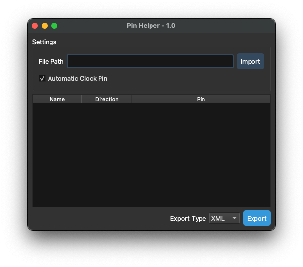

<h3 align="center">FDPinHelper</h3>

<div align="center">

[]()
[](https://github.com/0xtarhi/FDPinHelper/issues)
[](https://github.com/0xtarhi/FDPinHelper/pulls)
[](/LICENSE)

</div>

---

<p align="center"> A Pin-AutoAssigner for Fudan FPGA.</p>

## 📝 Table of Contents

- [📝 Table of Contents](#-table-of-contents)
- [🧐 About ](#-about-)
- [🎥 Demo ](#-demo-)
- [💭 How to build ](#-how-to-build-)
- [🏁 Getting Started ](#-getting-started-)
  - [Installing](#installing)
- [✍️ Authors ](#️-authors-)

## 🧐 About <a name = "about"></a>

FDPinHelper is a simple application to help you to create a pin mapping file for Fudan FPGA board.

Like tcl script used in Xiline FPGA board, FDPinHelper will generate a pin mapping file which is in the format of XML. The pin mapping file is used to map the ports of your design to the pins of FPGA board.

Currently, the file generated by FDPinHelper can be only used in FDE, which is a GUI tool for Fudan FPGA board to generate the bitstream. In the future, we will develop a new tool to combine FDE, FDPinHelper and [Wonton](https://github.com/Hi2129/Wonton_master)(virtual device simulator) to provide a complete solution for Fudan FPGA board.

## 🎥 Demo <a name = "demo"></a>



## 💭 How to build <a name = "working"></a>

1. Download [Qt6](https://www.qt.io/download) and install it.
2. Install Make, [CMake](https://cmake.org/download/), Ninja(not necessary), MinGW(*FOR WINDOWS ONLY*), and Git. Make sure that you have added the path of these tools to the environment variable `PATH`.
3. clone this repo.
4. Edit CMakeLists.txt, replace `CMAKE_PREFIX_PATH` with your location.
5. ```shell
   cd FDPinHelper
   mkdir build
   cd build
   cmake -DQT_ROOT_DIR=/your/path/to/Qt -GNinja ..
   cmake --build .
   ```
6. You can find the executable file in the `build/bin` directory.

**Note:** On <u>Windows</u>, you may need to copy following files and directories to the `build/bin` directory:
- `Qt6Core.dll`
- `Qt6Gui.dll`
- `Qt6Widgets.dll`
- `libgcc_s_seh-1.dll`
- `libstdc++-6.dll`
- `libwinpthread-1.dll`
- `plugins` directory
- `assets` directory(This directory is located in the root directory of this repo.)

Also, you may need to specify the compiler to MinGW. You can do this by adding `-DCMAKE_CXX_COMPILER=/your/path/to/mingw/bin/g++.exe` to the `cmake` command.

We have tested this application on Windows 11, macOS Montery and Arch Linux. If you have any problem, please create an issue. We will try our best to help you.

## 🎈 Usage <a name = "usage"></a>

1. Open the application.
2. Import Verilog file or SystemVerilog file.
3. The program will automatically analyze the file and generate the pin mapping table. If multiple modules are found in the file, you can select the module you want to map.
4. If you want to change the pin mapping, Just click the cell and select the pin you want to map to.
5. Finally, click the Export button to export the pin mapping file. (Now, this program only supports exporting to XML file.)

### Example:

File: `display_gate.v`

```verilog
module display ( clk, rst_n, lcd_en, lcd_rs, lcd_rw, lcd_db, lcd_rst );
  output [7:0] lcd_db;
  input clk, rst_n;
  output lcd_en, lcd_rs, lcd_rw, lcd_rst;
  
  ...

endmodule
```

It will generate a pin mapping file like this:

```xml
<design name="display">
<port name="lcd_db[0]" position="P7"/>
<port name="lcd_db[1]" position="P6"/>
<port name="lcd_db[2]" position="P5"/>
<port name="lcd_db[3]" position="P4"/>
<port name="lcd_db[4]" position="P9"/>
<port name="lcd_db[5]" position="P8"/>
<port name="lcd_db[6]" position="P16"/>
<port name="lcd_db[7]" position="P15"/>
<port name="clk" position="P77"/>
<port name="rst_n" position="P151"/>
<port name="lcd_en" position="P11"/>
<port name="lcd_rs" position="P10"/>
<port name="lcd_rw" position="P20"/>
<port name="lcd_rst" position="P18"/>
</design>
```

## 🏁 Getting Started <a name = "getting_started"></a>

These instructions will get you a copy of the project up and running on your local machine for development and testing purposes. 

### Installing

We are preparing a release version of this application. You can download it from the release page once it is released.

Now, you can only build this application from source code.

## ✍️ Authors <a name = "authors"></a>

- [@0xtaruhi](https://github.com/kylelobo) - Initial work
